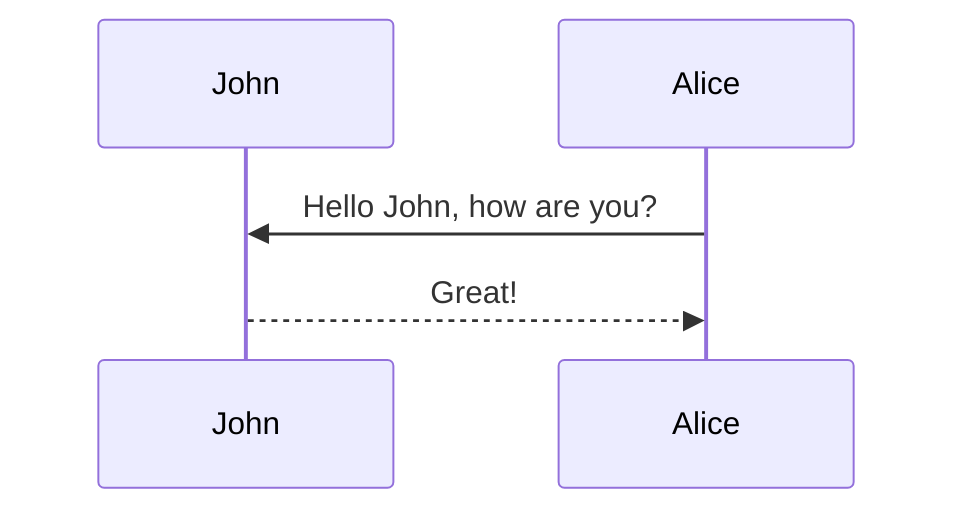

# DemoWebAPI

This is a Demo Web API, it is only implemented for MSRD tests

This API uses ASP.NET Core 2.2 now

analyzers:

dotnet add package StyleCop.Analyzers --version 1.1.118
dotnet add package Microsoft.CodeAnalysis.FxCopAnalyzers --version 2.9.8

https://ade.applicationinsights.io/subscriptions/95b44dd6-5808-485e-9f1a-923eaeef3b37/resourcegroups/rpr-umbraco/providers/microsoft.insights/components/rpr-umbraco-appin